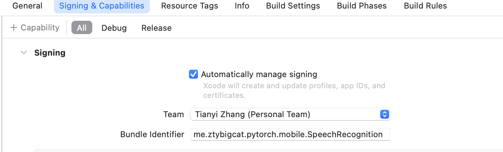
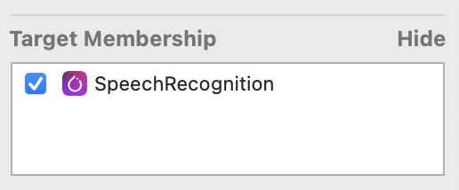

# Getting Started with Development 

## Step 1: Install Development Environment

You need a Mac for this project as it is iOS focused and requires compiling of native iOS code.
Go to https://reactnative.dev/docs/environment-setup and follow **React Native CLI Quickstart** guide to install necessary tools including: node, watchman, Xcode and CocoaPods. You can skip iOS Simulator as the default compiled Pytorch library does not run on simulators.

## Step 2: Install the Dependencies for the App

navigate to the root directory of the app and run
```bash
npm install
```
navigate to the ios directory of the app and run
```bash
pod install
```
Download mobile optimized wav2vec model [here](https://pytorch-mobile-demo-apps.s3.us-east-2.amazonaws.com/wav2vec2.ptl) and place it in the ios directory. You can also follow [this](https://github.com/pytorch/ios-demo-app/tree/master/SpeechRecognition) documentation to create your own mobile optimized model. 

**Note** the tutorial use python 3.8 and PyTorch 1.10. If the model you created use a higher version of Pytorch, you will need to bump up the version of Libtorch-Lite used in the app. You can change that in Podfile. The highest available released binary for Libtorch-Lite was released back in November of 2022. So if you need latest version of pytorch, you will need to compile that yourself. See DEV.md.


## Step 3: Build the iOS app and run

Double click the `SpeechRecognitionReactNative.xcworkspace` file in iOS folder to open it in Xcode. You will need to prepare your iPhone for development use. Also you need to register a (free) development team with apple to sign your app so it runs on iOS devices. After that you can go to your app workspace in Xcode and find Signing & Capabilities tab to change your team and Bundle Identifier.


Also click on the model ptl file and on file property window to the right make sure it is included in the build Target Membership.


Connect your iPhone to Mac with a data cable and choose it in the target device selector. Click the Play button and Xcode should build and install the app on your device.

If first time install your app, you need to trust the developer on your device. You can go to Settings-General-Profile to do that.

Enjoy 😃
### For Android

The app does not currently support Android as the native module on Android needs to be implemented in Java/Kotlin.


